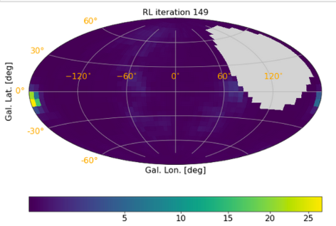
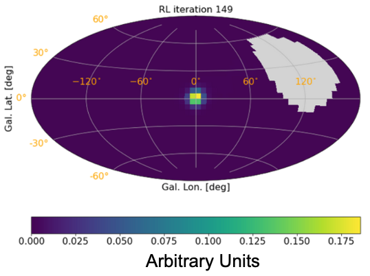
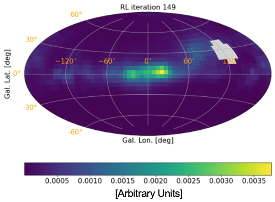

# Welcome to image deconvolution with COSIpy-classic

In this example, we'll use a Richardson-Lucy deconvolution algorithm to image the full simulated sky as observed during the balloon flight. There are three notebooks in this directory:
1. [RL-DataChallenge-Point_Sources-10XFlux-Ling.ipynb](RL-DataChallenge-Point_Sources-10XFlux-Ling.ipynb) which images 4 simulated point sources.
2. [RL-DataChallenge-511keV_10xFlux-Ling.ipynb](RL-DataChallenge-511keV_10xFlux-Ling.ipynb) performs the diffuse imaging of the 511 keV emission.
3. [RL-DataChallenge-Al26_10xFlux-Ling.ipynb](RL-DataChallenge-Al26_10xFlux-Ling.ipynb) performs the diffuse imaging of the Al-26 1.8 MeV decay line.

The three notebooks are almost identical in their execution, but different data sets will be uploaded, different response matrices will be used, and slightly different imaging parameters will be required. Please refer to the [data_products](../data_products) README for more details on the scientific background for these sources, and the simulated source models. This README should act as a guide offering additional information for each step of the analysis. The following sections align with the different steps within the notebooks.

**Before diving in**, you should be aware that these notebooks take signficant time and computer memory to run, more so than the spectral fitting notebook. Calculating the imaging response takes ~1 hour on a personal computer with 16 GB of memory, and to actually perform the Richardson-Lucy image deconvolution as it currently is written will take >75 GB of memory - this will likely be >6 hours even on powerful workstations. The imaging may not be doable with a personal computer and it is recommended that you complete this analysis on a workstation with more memory, if accessible. 

It's worth noting that the memory-intensive nature of this analysis is a consequence of using the original COSIpy-classic code, for which there wasn't a dedicated effort to reduce the computing requirements. Additionally, the Richardson-Lucy imaging is still being developed for COSI analysis, and the code is largely hard-coded in the notebooks. Future versions of Data Challenges will address these issues.

**Note as of January 20, 2023**: The Al-26 notebook was tested and executes in its current form on Ubuntu 20.04. We're hearing reports that the image deconvolution fails at early iterations (~10) on Mac M1 and does not run on Ubuntu 22.04, the latter of which cannot support pystan. This is under investigation. Please attempt this notebook as you wish, try changing parameters in the algorithm, or refer to the 511 keV imaging notebook for another example of diffuse imaging.

## Intial Setup

These cells import relevant packages, define file names, and read in the data files. 

## Bin the data

### Define the bins for the Compton data space
**Time bins:** The balloon environment is background-dominated, and the rates depend mainly on the latitude (i.e. geomagnetic cutoff) and the altitude (i.e. atmospheric depth). When analyzing the COSI flight data, we account for this changing background rate by binning the data set into time bins which we can individually fit with varying backgrounds. For the simulated data in this Data challenge, the background rate is constant with time, and therefore this time binning is less important. We include it here for flexibility.

Through extensive testing, **1800 second** (30 minute) time bins were found to strike a practical balance between a sufficiently precise treatment of background variability and computational means for the imaging analysis. 

You can feel free to play with the time binning. You may choose to decrease the size to 900 s, or increase it to 3600 s, for example, to see if there's an effect on the image (e.g. does it look less/more blurred, respectively, as you lump more data into more/fewer time bins?)

**Energy bins:** We need to define the energy bins exactly as they are defined in the response.

For point source imaging, we use a continuum response simulation which spans several energy bins across COSI's 0.2-5 MeV bandpass: **[150, 220, 325, 480, 520, 765, 1120, 1650, 2350, 3450, 5000] keV**.

For positron-electron annihilation at 511 keV, we use a response simulation with only one energy bin around the 511 keV signature: **501-521 keV**.

For Al-26, we use a response simulation with only one energy bin around the 1809 keV photopeak signature: **1803-1817 keV**.

**Sky pixel size:** As with the energy binning, the pixel size here must match that of the response. The response matrix that we are providing for this COSI-balloon analysis assumes $6^{\circ} \times 6^{\circ}$ resolution.

### Binning
Calling `.get_binned_data()` will loop through all of the events in the simulated data set to fill the bins of the Compton Data Sapce (CDS; [../README.md](../README.md)).

### Examining the shape

The binned data are contained in "analysis1.dataset.binned_data." This is a 4-dimensional object representing the 5 dimensions of the CDS: (time, energy, $\phi$, FISBEL).

The number of bins in each dimension are shown by calling "shape."

Per the binning definitions above, there are 2240 time bins, 10 energy bins for the continuum analysis or 1 bin for line analysis (as governed by those in the response), 30 $\phi$ bins $(6^{\circ}$ bin size spanning the full $0-180^{\circ}$ range of possible Compton scattering angles), and 1145 FISBEL bins. 

FISBEL is a unique index which specifies the $\chi$ and $\psi$ dimensions of the CDS that specify the direction of the scattered photon in the first interaction. 

How do we end up with 1145 FISBEL bins? Consider a sphere which is $4 \pi( 180^{\circ}/ \pi)^2 = 41252.96 \textrm{ deg}^{2}$ \
Given our $6 \textrm{ deg}^{2}$ binning, we have $41252.96 \textrm{ deg}^{2}$ / $6 \textrm{ deg}^{2}$ $\sim$ 1145 bins.

The notebook will show you how to get the shape of the data set, and how to extract the bin sizes.

### Inspecting the data

Since we have the simulated data read and binned into the CDS, we can now make raw spectra, light curves, and other projections of the data. Two examples of this are shown in the notebook. The spectrum isn't entirely enlightening when looking at the single bin of the line analyses, but in the point source notebook with the continuum response, we can see the total simulated spectrum. This is for the duration of the balloon flight (total time = 4031996 seconds = 46.6 days), and the majority of photons in this spectrum are from the background simulation. The spectrum shows a clear 511 keV line, which fills the narrow 4th bin of the full continuum spectrum, which has contributions from the Ling background and from the Galactic center source simulation. The light curve is dominated by background radiation, but in the point source notebook one can see the variability in the latter half of the flight due to the bright Crab nebula within the FOV.

## Pointing Class

The pointing class handles the aspect information of the COSI-balloon instrument. During flight, COSI freely floated on the balloon platform. This means that, unlike a space or ground-based telescope with well-defined pointings and slewing schedule, its orientation was largely dependent on the unconstrained path of the balloon. It was a zenith-pointing instrument, meaning that its vertical orientation pointed straight above the hanging instrument, towards the balloon above it. The exception to this freedom is that during the day time, COSI's azimuthal orientation was fixed such that its solar panels remained oriented facing the Sun. At nighttime, though, the instrument freely rotated about its azimuth. 

This is all to say that COSI's orientation changed rapidly during flight. We had a differential GPS onboard, which recorded the yaw, pitch, and roll of the balloon payload every second. In the COSI-balloon calibrations performed in MEGAlib, this is converted to the X, Y and Z pointing of the COSI-balloon in Galactic coordinates. This aspect information is contained in the .tra.gz simulation file and the pointing information for each event is read in during the `.read_COSI_DataSet()` command. This pointing class bins this aspect information into a list of 'stable' pointings for which the change in the aspect is below a certain angular threshold. By default, this threshold is set to 5 degrees. This information is required when creating the sky model or image response.

In the point source imaging [notebook](RL-DataChallenge-Point_Sources-10XFlux-Ling.ipynb), we include some visuals to help you understand the pointings. For example, all of the Z pointings (i.e. COSI's zenith) are plotted in Galactic coordinates, with the Crab nebula position overlaid. From this, you can see the path that COSI traced across the sky. This can be compared with the flight path shown in the main [README](../README.md). We also can plot the elevation of any source within COSI's FOV. The elevation for the Crab position is shown, and we can see the source move in and out of the field of view. In this plot, the "horizon" lies at the maximum extent of what COSI can see beyond zenith, which is ~60 deg from zenith; therefore, COSI's zenith lies 60 deg above the horizon. The Crab is more visible in the latter part of the flight when COSI floated further north. We notice, too, that the Crab is always somewhat off-axis; it is never directly overhead the instrument at zenith.

## Background Model

As discussed in [data_products](../data_products), we model the background using extensive simulations of Earth's atmospheric $\gamma$-ray background based on the Ling model. The simulations use an accurate mass model of the COSI-balloon instrument during flight and follow the true orientation of the instrument as it traveled along its flight path. The simulations were performed in MEGAlib, and we have provided an .npz background response file which contains the Ling model simulation binned into the Compton Data Space. Defining the background model here loads this response.

## Read in Response Matrix

The instrument response matrix is created through large simulations in MEGAlib's ResponseCreator program. There are different response matrices for the point sources and the diffuse line emission based on the energy binning. The point sources use the continuum response, which spans the full energy range of the COSI-balloon, whereas the 511 keV and Al-26 analyses only have one energy bin around the line of interest.

After we read in the response, which is a 5D numpy array (.npz format), we can explore the shape of the data space to better understand the connections between the response matrix, the data set, and the background model. 

The shape of the response spans (Galactic latitude $b$, Galactic longitude $\ell$, Compton scattering angle $\phi$,  FISBEL, energy). The size of each dimension depends on the chosen pixel size. Here, we've chosen $6^{\circ}$ pixels. 

Galactic latitude $b \in [-90^{\circ}, 90^{\circ}] \rightarrow$ 30 bins.\
Galactic longitude $\ell \in [-180^{\circ}, 180^{\circ}] \rightarrow$ 60 bins.\
Compton scattering angle $\phi \in [0^{\circ}, 180^{\circ}] \rightarrow$ 30 bins (`analysis1.dataset.phis.n_phi_bins`).\
See above for explanation of 1145 FISBEL bins (`rsp.rsp.n_fisbel_bins`).\
The continuum response has 10 energy bins.

The shape of the data and background objects span (time, energy, Compton scattering angle, FISBEL).

Given the time bin size `Delta_T` which we defined at the beginning of the notebook, there are 2240 time bins.

The notebook will show you how to find these shapes and bin sizes.

## RL Imaging

Up until this point, the analysis steps have been completely generic and parallel what is required for standard COSI analysis. The spectral fitting notebook almost identically follows the above steps. All subsequent explanations are specific to the image deconvolution algorithims, and as you can see the RL algorithim and supporting functions are hard-coded in this notebook. These tools will be integrated into the COSIpy library for the next data challenge iteration.

## Setup for imaging / Define the imaging response

**Defining a grid on the sky to make images**  \
Here we initialize a regular 2-D sky grid (6 deg x 6 deg, per the previously defined pixel size). This grid is used later in the notebook when generating images with the RL algorithm.

**Convert sky grid to zenith/azimuth pairs for all pointings**  \
The response is a function of coordinates: R(Z, A; $\phi$, $\psi$, $\chi$)

Z = zenith (angle in instrument coordinates) \
A = azimuth (angle in instrument coordinates) \
$(\phi, \psi, \chi)$ are the CDS angles. 

Z and A point to a location on the sky via a unique mapping of (Z, A) $\leftrightarrow$ $(\ell, b)$, i.e. Galactic longitude and latitude, that is changing with time. This mapping is calculated with "Great Circles," trigonometric functions, etc. See the "zenaziGrid()" function in COSIpy_tools_dc1.py. Note that the attitude is what defines the (Z, A) $\leftrightarrow$ $(\ell, b)$ transformation. The attitude is just a rotation matrix, which can be specified multiple ways. Currently the .tra.gz file contains the attitude for every event, specified by the orientation of the spacecraft axes (given in Galactic coordinates). In the future, this will be part of a separate “spacecraft file” that contains the spacecraft location/orientation information (i.e. Earth’s latitude/longitude + attitude quaternion) necessary for data analysis.

Here, we convert the sky grid to said zenith/azimuth pairs for later convolution with the response.

**Get observation indices for non-zero bins** \
To speed up the imaging, we only analyze bins with non-zero counts in both the sky response and background response. We also select only one energy bin for the analysis. In the case of point source imaging, we choose the 320-480 keV bin ("ebin = 2") of the continuum response because it has the highest effective area. The 511 keV and 1809 keV responses only have one energy bin, and thus the index is necessarily "ebin = 0."

**Reduce the response dimensions** \
This cell reduces our energy dimension to the sole energy bin selected above and reduces the length of the CDS array to only the non-zero entries. 

**Function to get the response of an image for arbitrary time binning** \
For each point in time, we calculate the response. This takes into account that within the selected time bin width Delta_T, the instrument moves with respect to the fixed Galactic coordinate system, and applies weighting whenever the change in aspect angle exceeds 5 degrees (defined by the Pointing class).

**Exposure map** \
Here we plot the exposure map, which is the response multiplied by the actual observation time in the field of view within each Delta_T bin. For a more complete understanding of COSI-balloon's observations, we divide by the pixel size on the sky. This allows for estimates of the effective area (exposure) of extended sources versus point sources.

## Set up for RL Algorithim

There are many definitions required for the RL algorithim, including defining regions of the sky with poor exposure, defining the number of time bins, selecting the energy bin for imaging, defining an intial starting map (here defined to be an isotropic map), etc. See the details in the notebook for more information. Be aware that the stan model that is loaded often will print out a large warning, but the cell does run correctly.

## Richardson-Lucy Algorithim

The steps follow the algorithm as outlined in [Knödlseder et al. 1999](https://ui.adsabs.harvard.edu/abs/1999A%26A...345..813K/abstract). Refer to that paper for a mathematical description of the algorithm.

The total memory used during these iterations is about 94 GB for the continuum response, 75 GB for the 511 keV, and 105 GB for the Al-26!! You might be limited on your personal computer, and at the very least, you might not be able to do much else with your machine while this is running. 

#### Adjustable parameters
There are three parameters at the beginning of this RL cell which we encourage you to adjust. In fact, it is often necessary to adjust these parameters depending on the data being studied. A list of suggested paramters for different cases is provided [here](imaging_suggested_parameters.pdf).

- map_init\
This is the flux value of the initial, isotropic map. Typically, a value of 0.01 works well. For stronger sources, you can try increasing it to 0.1 or 1.0. As an example, running the algorithm on a source-only (no background) simulation of the Crab, Cen A, Cygnus X-1, and Vela works well with map_init = 0.01. However, when imaging these sources each simulated with 10X their true flux values, the algorithm fails at 0.01 and works when map_init = 1.0.

- iterations\
This is the number of RL iterations. You can set this to a small value, say 50, as you get used to using the algorithm. In our testing, though, for fully converged images we usually let the algorithm run for 150 iterations. ***This can take anywhere from several hours (usually simulations without background) to overnight (simulations with background) to run.***

- afl_scl\
This is a scaling factor for the delta map (a map which encodes the changes between each iteration) which we call the "acceleration parameter." This allows the delta map to be afl_scl times stronger than the original RL algorithm suggests (c.f. [Knoedlseder+1999](https://ui.adsabs.harvard.edu/abs/1999A%26A...345..813K/abstract)).\
The default value here is 2000, though 1000 also works well. If you find that the algorithm returns "Fit failed" messages after running for awhile, for example, lowering this acceleration parameter to 1000 can help.

Other parameters you can adjust:
- mu_Abg, sigma_Abg\
There is a prior in the background fit defined by mu_Abg $\pm$ sigma_Abg. By default, mu_Abg and sigma_Abg are set to fitted_bg and most testing has been done with this setting. You can try constraining the fit by decreasing sigma_Abg, for example, to sigma_Abg/2., sigma_Abg/10., which would enable to fit to vary by 50%, 10% of the initial guess.

- delta_map_tot_old\
You can change the exponent of the denominator. By default, it is set to 0.25 to help avoid exposure edge effects. All testing has been done with this fourth root. However, you can try setting it to 0, 0.5, etc. to see what happens. You can also try smoothing delta_map_tot_old with a Gaussian filter.

## Confirming algorithim convergence

After the RL algorithm is done running, you can plot the fit likelihoods and the likelihoods of maps (vs. initial map, i.e. basically only background). The likelihood is a proxy of algorithm convergence; if the likelihood remains unchanged after a certain number of iterations, then further iterations show an equally likely distribution of photons as the sky as previous images. Thus, when the likelihood plots plateau, we can say that the algorithm has converged. 

Wildly oscillating likelihoods, for example, indicate instability in the algorithm. Try changing the suggested parameters and run the algorithm again.

Note that the flux may increase without bound as the number of iterations increases. This is an intrinsic consequence of the RL algorithm itself. The algorithm may settle into imaging artifacts as the iterations progress, particularly in areas of poor exposure, and amplify the flux in these regions. This is why determining the "final" iteration of a RL algorithm, and thereby the "correct" image, is an open question. The user must consider different metrics, including the likelihood here, to make the best judgment.  

## Final image

**IMPORTANT NOTE:** The color scales for all images are in arbitrary units. The COSI team is currently working on determining the level of the flux. 

Sample final images are included in the "plots" folder.

**Point Source Notebook:** \
The Crab nebula is the only easily visible source in this combined simulation of 10x flux Crab, 10x flux Cygnus X-1, 10x flux Centaurus A, 10x Vela, and 1x flux Ling background (scaled to the observed 2016 flight background level). A sample final image is shown below:

You can play with the color scaling to try to enhance the appearance of the other sources. Vela is likely too dim to be seen, however. 

You can also try running this notebook without including the Ling background. Change the loaded .tra.gz file at the beginning, adjust RL parameters as necessary, and see if the four point sources are more easily resolved without background contamination!

As another suggestion, what happens if you run this notebook using the 511 keV response? The 1809 keV response? A different energy bin of the continuum response? 

You can try combining these four point sources and Ling background with the 10x 511 keV and 10x Al-26 simulations for a full combined imaging test, using all three response simulations too.

**Positron Annihilation at 511 keV:** \
We clearly see the "bulge" emission of positron-electron annihilation at the center of the Milky Way:

This was also seen in the published image of real COSI-balloon flight data [(Siegert et al. 2020)](https://iopscience.iop.org/article/10.3847/1538-4357/ab9607/meta):

The extended disk emission seen in the SPI image (see [Science Background](../data_products/README.md)) is not visible here. This is expected; SPI saw about 1 photon per week from the disk and has over a decade of observation time. There is not enough data in the 46-day balloon flight to image the disk.

However, we can still probe the emission morphology of the bulge by fitting a 2-D Gaussian, for example, to our simulated image. Constraining the parameters of this fit is important for modeling the physics (positron propogation, point sources of positrons, etc.) behind this enduring mystery.

**Al-26:** \
As expected, we observe extended Al-26 emission along the Galactic Plane. There is concentrated emission in the Inner Galaxy. The RL algorithm therefore behaves as expected.

Given that only ~100 Al-26 photons were detected during the COSI-balloon flight $(3.7 \sigma$ significance, [Beechert et al. 2022](https://iopscience.iop.org/article/10.3847/1538-4357/ac56dc/meta)), imaging the emission at its true flux instead of 10x strength would likely result in only imaging artifacts. Consider the following calculation. For $n$ spatial bins each with measurement significance $n_i$, the total significance of a measurement is $$s = (\sum_{i = 1}^{n} s_i^2)^{1/2}.$$

Even if requiring only a weak $2\sigma$ measurement in each bin, for example, the maximum $n$ number of bins for a total $3.7\sigma$ measurement is approximately 3.4. In other words, a $3.7\sigma$ significant measurement distributed across the broad, diffuse Al-26 emission which spans the Galactic Plane would result in few spatial bins with meaningful significance. 

As with the positron annihilation, we can fit the simulated 10x flux image with a 2-D Gaussian to characterize the morphology of Galactic Al-26. 

Future data challenges will image Al-26 as seen with the COSI satellite. Increased observation time, increased effective area, finer angular resolution, and observations at high Galactic latitudes (extending above and below the Galactic Plane) have great potential to advance understanding of this radioisotope.

