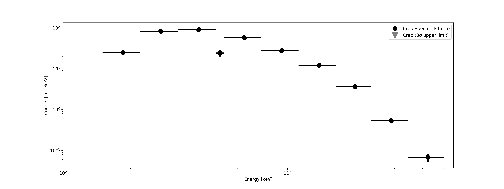
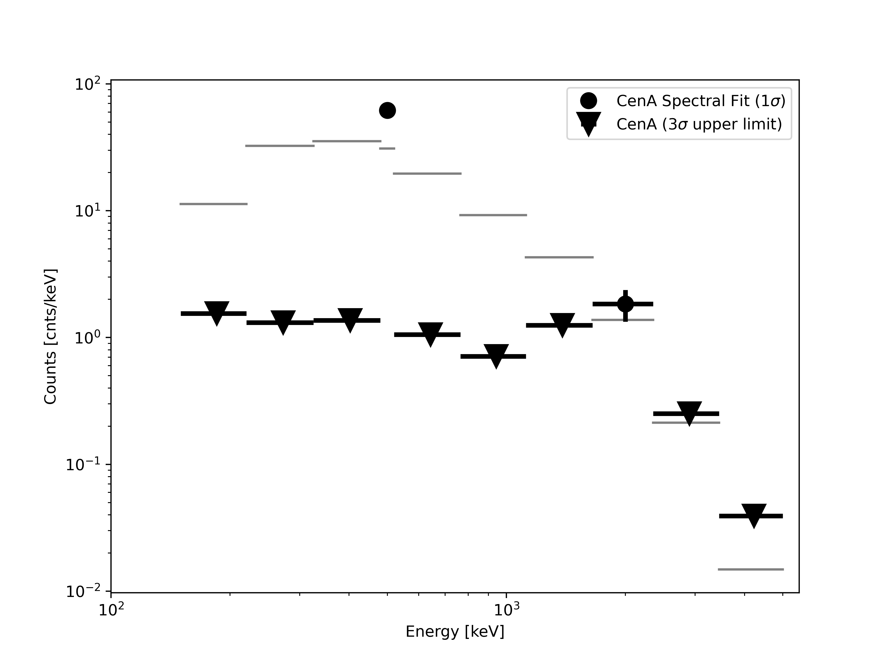
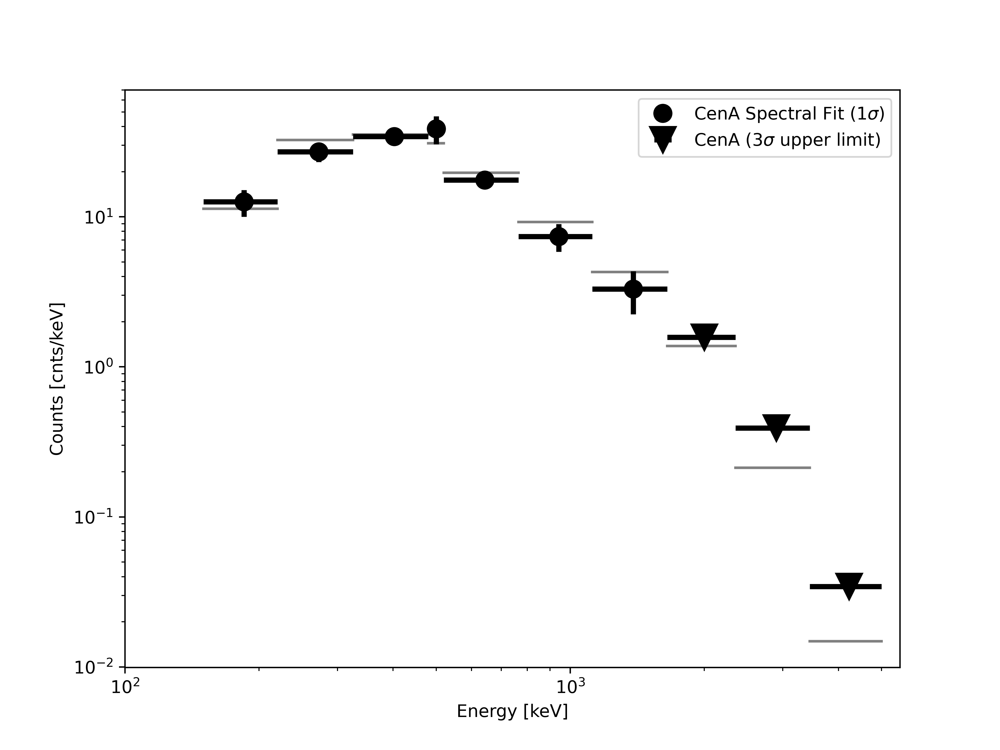

# Welcome to spectral fitting with COSIpy-classic

In this notebook, we'll perform a spectral fit on the Crab nebula and Centaurus A using simulated balloon flight data. There are other simulated sources in the data set - Cygnus X-1, Vela, the 511 keV emission from positron annihilation and the Al-26 1.8 MeV decay line - but these are not explored in this notebook. Please refer to the [data_products](../data_products) README for more details on the scientific background for these sources, and the simulated source models. This README should act as a guide offering additional information for each step of the analysis. The following sections align with the different steps within the notebook.

Before diving in, you should be aware that this notebook takes signficant time and computer memory to run. The final spectral fit can take 1 hour on a personal computer with 16 GB of memory. If you have access to a workstation with more memory, that will save you time.

## Intial Setup

These cells import relevant packages, define file names, and read in the data files. 

## Bin the data

### Define the bins for the Compton data space
**Time bins:** The balloon environment is background dominated, and the rates depend mainly on the latiude (i.e. geomagnetic cutoff) and the altitude (i.e. atmospheric depth). When analyzing the COSI flight data, this change in background rate needs to be taken into account, and thus we bin the data set into time bins so we can fit each bin with varying backgrounds. For the simulated data in this Data challenge, the background rate is constant with time, and therefore this time binning is less important. We include it here for flexibility.

Through testing with the flight data, **7200 second** (2 hr) time bins were found to strike a practical balance between a sufficiently precise treatment of background variability and computational means for the spectral analysis. 

**Energy bins:** We need to define the energy bins exactly as they are defined in the response.

For point source analysis, we use a continuum response simulation which spans several energy bins across COSI's 0.2-5 MeV bandpass: **[150, 220, 325, 480, 520, 765, 1120, 1650, 2350, 3450, 5000] keV**.

**Sky pixel size:** As with the energy binning, the pixel size here must match that of the response. The response matrix that we are providing for this COSI-balloon analysis assumes **$6^{\circ} \times 6^{\circ}$ resolution**.

### Binning
Calling `.get_binned_data()` will loop through all of the events in the simulated data set to fill the bins of the Compton Data Sapce (CDS; [../README.md](../README.md)).

### Examining the shape

The binned data are contained in "analysis1.dataset.binned_data." This is a 4-dimensional object representing the 5 dimensions of the CDS: (time, energy, $\phi$, FISBEL).

The number of bins in each dimension are shown by calling "shape."

Per the binning definitions above, there are 560 time bins, 10 energy bins (as governed by those in the response), 30 $\phi$ bins $(6^{\circ}$ bin size spanning the full $0-180^{\circ}$ range of possible Compton scattering angles), and 1145 FISBEL bins. 

FISBEL is a unique index which specifies the $\chi$ and $\psi$ dimensions of the CDS that specify the direction of the scattered photon in the first interaction. 

How do we end up with 1145 FISBEL bins? Consider a sphere which is $4 \pi( 180^{\circ}/ \pi)^2 = 41252.96 \textrm{ deg}^{2}$ \
Given our $6 \textrm{ deg}^{2}$ binning, we have $41252.96 \textrm{ deg}^{2}$ / $6 \textrm{ deg}^{2}$ $\sim$ 1145 bins.

The notebook will show you how to get the shape of the data set, and how to extract the bin sizes.

### Inspecting the data

Since we have the simulated data read and binned into the CDS, we can now make raw spectra, light curves, and other projections of the data. Two examples of this are shown in the notebook. The spectrum shows the total simulated spectrum for the duration of the balloon flight (total time = 4031996 seconds = 46.6 days), and the majority of photons in this spectrum are from the background simulation. The spectrum shows a clear 511 keV line, which fills the narrow 4th bin of the full continuum spectrum, which has contributions from the Ling background and from the Galactic center source simulation. The light curve is dominated by background radiation but one can see the variability in the latter half of the flight due to the bright Crab nebula within the FOV.

## Pointing Class

The pointing class handles the aspect information of the COSI-balloon instrument. During flight, COSI freely floated on the balloon platform. This means that, unlike a space or ground-based telescope with well-defined pointings and slewing schedule, its orientation was largely dependent on the unconstrained path of the balloon. It was a zenith-pointing instrument, meaning that its vertical orientation pointed straight above the hanging instrument, towards the balloon above it. The exception to this freedom is that during the day time, COSI's azimuthal orientation was fixed such that its solar panels remained oriented facing the Sun. At nighttime, though, the instrument freely rotated about its azimuth. 

This is all to say that COSI's orientation changed rapidly during flight. We had a differential GPS onboard, which recorded the yaw, pitch, and roll of the balloon payload every second. In the COSI-balloon calibrations performed in MEGAlib, this is converted to the X, Y and Z pointing of the COSI-balloon in Galactic coordinates. This aspect information is contained in the .tra.gz simulation file and the pointing information for each event is read in during the .read_COSI_DataSet() command. This pointing class bins this aspect information into a list of 'stable' pointings for which the change in the aspect is below a certain angular threshold. By default, this threshold is set to 5 degrees. This information is required when creating the sky model or image response.

In the notebook we have some visuals to help you understand the pointings. For example, all of the Z pointings (i.e. COSI's zenith) are plotted in Galactic coordinates, with the Crab nebula and Cen A position overlaid. From this, you can see the path that COSI traced. This can be compared with the flight path shown in the main [README](../README.md). We also can plot the elevation of any source within COSI's FOV. The elevation for the Crab and Cen A position are shown, and we can see the sources move in and out of the field of view. In these plots, the "horizon" lies at the maximum extent of what COSI can see beyond zenith, which is ~60 deg from zenith; therefore, COSI's zenith lies 60 deg above the horizon. The Crab is more visible in the latter part of the flight when COSI floated further north. We notice, too, that the Crab is always somewhat off-axis; it is never directly overhead the instrument at zenith. Cen A, however, is much higher in COSI's FOV at the beginning of the flight, and at times is directly overhead at zenith.

## Background Model

As discussed in [data_products](../data_products), we model the background using extensive simulations of Earth's atmospheric $\gamma$-ray background based on the Ling model. The simulations use an accurate mass model of the COSI-balloon instrument during flight and follow the true orientation of the instrument as it traveled along its flight path. The simulations were performed in MEGAlib, and we have provided an .npz background response file which contains the Ling model simulation binned into the Compton Data Space. Defining the BG model here loads this response and it is scaled to match the mean rate in the data set. 

## Read in Response Matrix

The instrument response matrix is created through large simulations in MEGAlib's ResponseCreator program. This point source analysis uses the continuum response, which spans the full energy range of the COSI-balloon. After we read in the response, which is a 5D numpy array (.npz format), we can explore the shape of the data space to better understand the connections between the response matrix, the data set, and the background model. 

The shape of the response spans (Galactic latitude $b$, Galactic longitude $\ell$, Compton scattering angle $\phi$,  FISBEL, energy). The size of each dimension depends on the chosen pixel size. Here, we've chosen $6^{\circ}$ pixels. 

Galactic latitude $b \in [-90^{\circ}, 90^{\circ}] \rightarrow$ 30 bins.\
Galactic longitude $\ell \in [-180^{\circ}, 180^{\circ}] \rightarrow$ 60 bins.\
Compton scattering angle $\phi \in [0^{\circ}, 180^{\circ}] \rightarrow$ 30 bins ("analysis1.dataset.phis.n_phi_bins").\
See above for explanation of 1145 FISBEL bins ("rsp.rsp.n_fisbel_bins").\
The continuum response has 10 energy bins.

The shape of the data and background objects span (time, energy, Compton scattering angle, FISBEL).

Given the time bin size "Delta_T" which we defined at the beginning of the notebook, there are 560 time bins.

The notebook will show you how to find these shapes and bin sizes.

## Point Source Response

Up until this point, the analysis steps have been completely generic and parallel what is required for standard COSI analysis. The imaging notebook is almost identical for the above steps. Everything that comes next is specific for the spectral fitting of point sources.

We'll start by looking at the Crab Nebula. The first step will be to create the point source response for the Crab Nebula observation. The `rsp.calculate_PS_response` command combines the instrument response matrix and the pointing information to determine the response from the Crab location (read in with `l_crab` and `b_crab` parameters) for each instance in time. The background response is also read in here since it is used to find any empty bins in the CDS to be removed from the fitting analysis.

The counts for the simulated data, the background model, and the Crab point source sky response are all shown as a function of the time bins in the notebook. The data set, as said already, is dominated by the background simulation; however, in the latter half of the flight the counts from the bright Crab coming in and out of the FOV is seen. The background model is constant with time for the simulated data (a tracer can be used for flight data with variable backgrounds), and the normalization is scaled to match the simulated data set, as can be seen visually here. The point source response for the Crab shows this clearly (here is is normalized to 1, but we scale the counts to be more visible). And now we have our components read for the fit.

## Fitting the Crab Spectrum

For each energy, we now fit the coefficients for the sky and background models that best match the data for each time bin (see [README](../README.md) for more information). This currently is done for each energy individually with no consideration for neighboring bins. Given the number of bins in our data space, this can take about an hour to run the full fit.

The final spectrum you obtain should be identical to this: 

You will probably notice immediately that the 4th bin, the narrow one that includes the 511 keV line, is too low. This is due to the fact that we do not account for the strong 511 keV Galactic source, which is present in the data set, in the background model.  In the [plots](plots) directory, we have included a direct comparison with the expected spectrum from the Crab simulation itself: [plots/Crab_combined_compare.png](plots/Crab_combined_compare.png). Other than the outlier bin at 511 keV, the fit is generally in good agreement with the expected results. This gives us a proof of concept for our spectral fitting tool in COSIpy-classic.

# CenA Analysis

Since there are other point sources included in this data set, let's take a look the spectral fit for the second brightest source: Cen A. Since we’ve already loaded the COSI-balloon simulated data, response matrix and background model, we only need to redefine the point source response using Cen A’s coordinates and repeat the fit. Again, the fit will take about an hour, depending on your computer performance.

## First attempt at fitting the Cen A Spectrum

After recomputing the point source response, you'll see that the extracted Cen A spectrum will not look great. You should find the following fit results, where again we've included the expected spectrum from simulations:

The upper limits indicate when the signal-to-noise ratio (SNR) > 3. The error bars for the Cen A spectrum are very large, and almost all energy bins have upper limits. 

This poor fit is due to the bright simulated Crab source interfering with the fit. To fix this, we would need to include the Crab in the background model. Because the elevation of the Crab in COSI's field of view is changing over time, our background model would now need to be time-dependent. However, our current fitting algorithm only includes one background parameter, so we cannot handle a time-dependent background at this point. We explore this hypothesis by looking at a data set which includes the simulated Cen A along with background, without the other simulated sources. 

In the notebook that follows, we repeat the above steps that we performed for the Crab analysis, by reading in a new data set, defining the background model, and redefining the point source response. We're then ready to redo the Cen A spectral analysis with this simplified example.

## Second attempt at fitting the Cen A Spectrum

Now that we only have Cen A in our data set, without contamination from the Crab, the extracted spectrum we find from the fit matches closely with what we would expect from simulations:

This is an important lesson about the importance of having an accurate background model. Not only do we need more sophisticated background models which include bright sources not being analyzed, but we also to be able to account for the complicated time variability in the measured background during flight. This will be a focus for the next Data Challenge.
