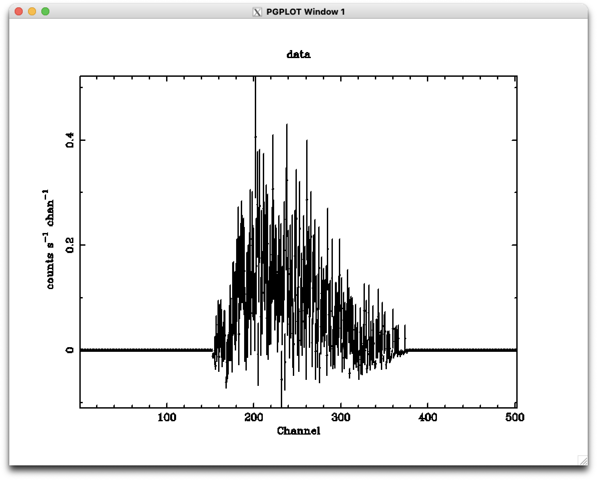
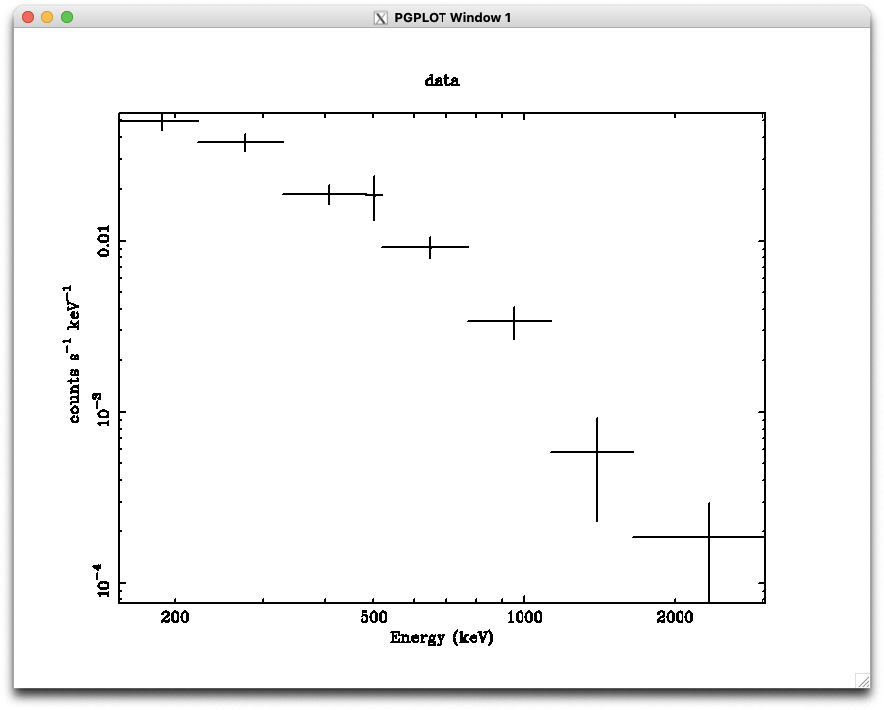
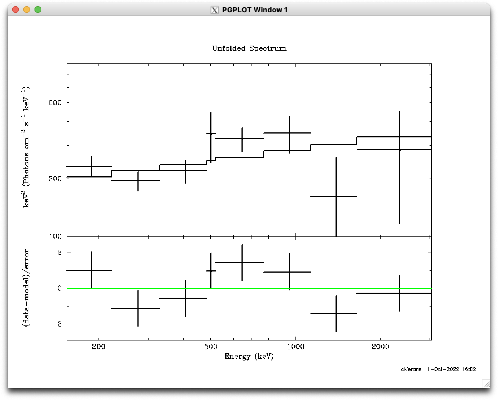
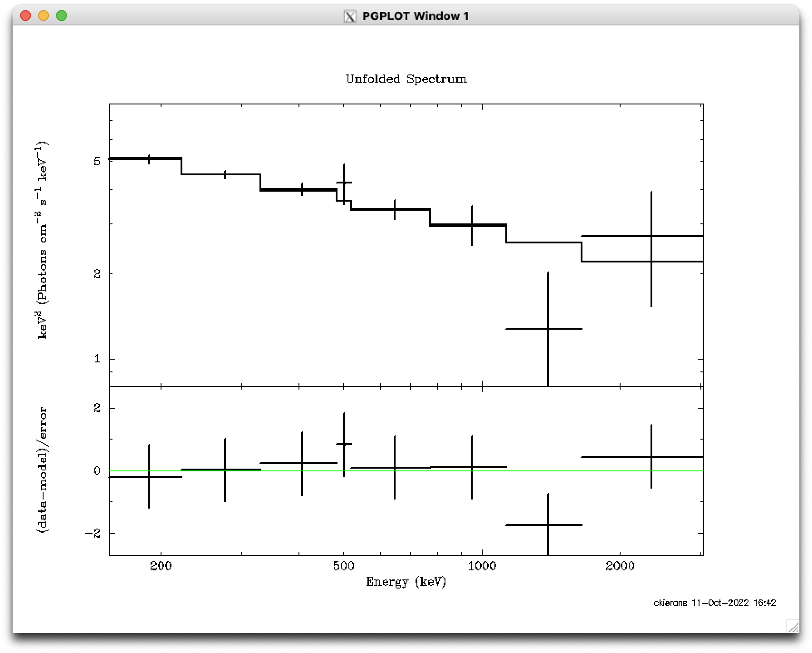
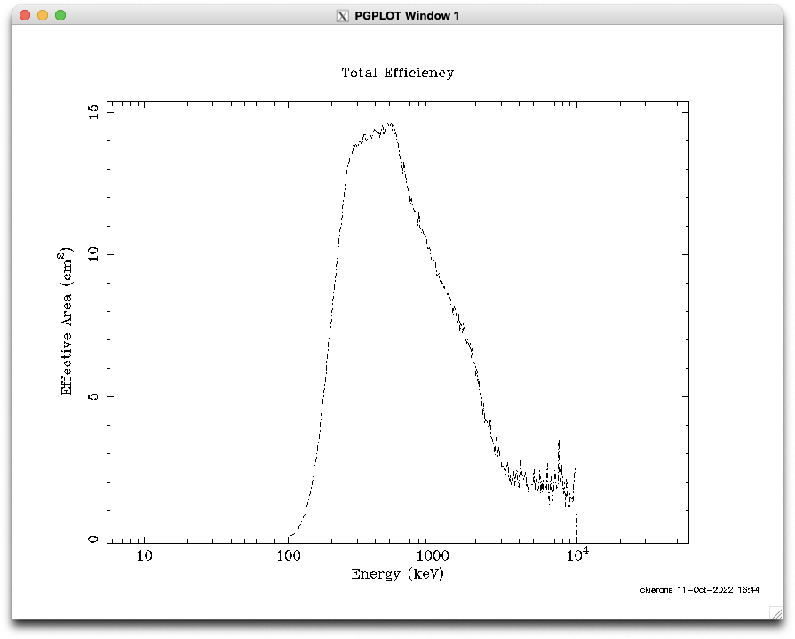
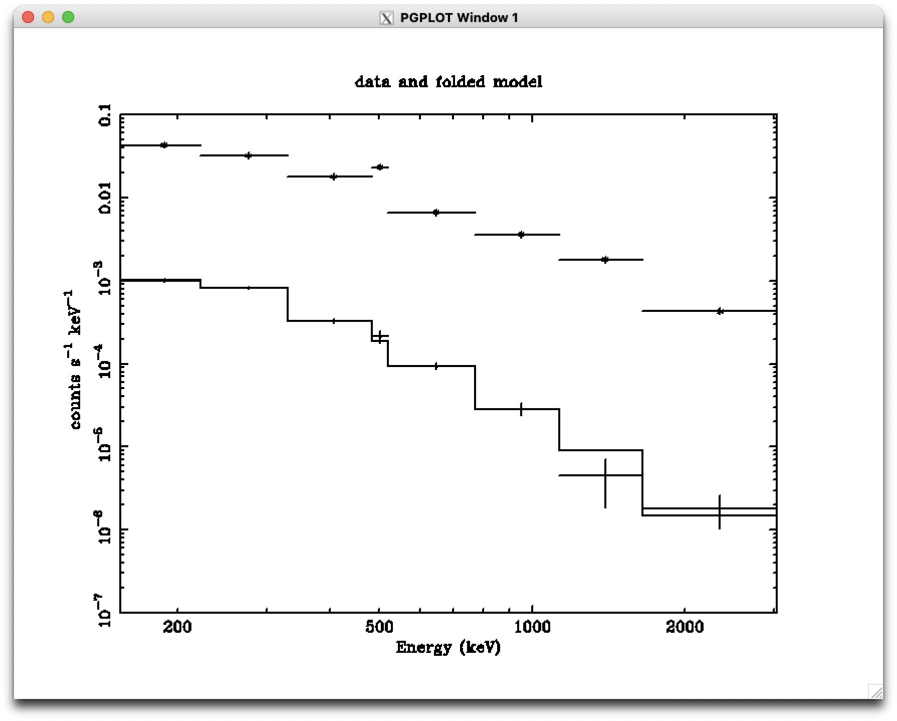

# Using XSPEC for COSI spectral analysis and simulations

This tutorial is meant to serve as a starting point for using the X-ray spectral fitting package with COSI data. We will start by using an extracted data set from the 2016 COSI balloon flight for during its observation of GRB 160530A (source_and_background.pha). This tutorial will walk you through the fit of this data set, and then will show an example of how to simulate sources using the provided instrument response and background files. In future Data Challenges, we will release tools for users to be able to make their own response files so one can use XSPEC analysis tools with more flexibility. 

XSPEC is an extremely mature software package that a large portion of the high-energy community uses. It has a huge number of models and flexibility for adding custom models as needed. Once the basic commands are known, it is easy to use, and spectral analysis can be performed efficiently. It has a very convenient spectral simulation tool that will be helpful to the COSI science team and will broaden the COSI community. Although not discussed in this tutorial, there is a pyXSPEC package that allows for automated scripts to be written. The main XSPEC website is https://heasarc.gsfc.nasa.gov/xanadu/xspec/ and a more extensive manual can be found there. XSPEC is installed by default as part of the HEASoft tools. Thus, it is installed as part of the COSItools. 

Here, we assume that the user has extracted a spectral file (source_and_background.pha), a background file (background.pha), a response matrix (response.rmf), and an ancillary response file (area.arf) - these are provided in the above download. **Command#1** below gives an example of using the FTOOL `fdump` to see what is inside the file. The useful information is in the FITS file binary table extension (see more details about FITS files [here](https://fits.gsfc.nasa.gov/fits_documentation.html)). For example, there are two fields in each row of data (CHANNEL and COUNTS), and there are 502 rows in the table.  

The other thing that is important to check is that you have specified the names of the background file, the response matrix, and the ancillary response file in the header under the keywords BACKFILE, RESPFILE, and ANCRFILE.  When you load the file into XSPEC, these files will be read in automatically from the same directory.  The easiest way to put the file names in the header is to use the FTOOL `fv`, search for the keywords, and type or copy the filenames in.

Both the `fdump` and `fv` commands are apart of FTOOLS and can be used in the regular command line or from inside XSPEC.

**Command#1**
```
[MacBook-Pro-4:cosi/2022/tutorial] jat% fdump source_and_background.pha
```
The output will be as follows:
```
Name of optional output file[STDOUT] 
Names of columns[-] 
Lists of rows[-] 
SIMPLE  =                    T / file does conform to FITS standard
BITPIX  =                  -32 / number of bits per data pixel
NAXIS   =                    0 / number of data axes
EXTEND  =                    T / FITS dataset may contain extensions
COMMENT   FITS (Flexible Image Transport System) format is defined in 'Astronomy
COMMENT   and Astrophysics', volume 376, page 359; bibcode: 2001A&A...376..359H
TELESCOP= 'COSI    '
INSTRUME= 'COSI    '
END
 
XTENSION= 'BINTABLE'           / binary table extension
BITPIX  =                    8 / 8-bit bytes
NAXIS   =                    2 / 2-dimensional binary table
NAXIS1  =                    8 / width of table in bytes
NAXIS2  =                  502 / number of rows in table
PCOUNT  =                    0 / size of special data area
GCOUNT  =                    1 / one data group (required keyword)
TFIELDS =                    2 / number of fields in each row
TTYPE1  = 'CHANNEL '           / label for field   1
TFORM1  = 'J       '           / data format of field: 4-byte INTEGER
TTYPE2  = 'COUNTS  '           / label for field   2
TFORM2  = 'J       '           / data format of field: 4-byte INTEGER
TUNIT2  = 'count   '           / physical unit of field
EXTNAME = 'SPECTRUM'           / name of this binary table extension
TELESCOP= 'COSI    '           / telescope/mission name
INSTRUME= 'COSI    '           / instrument/detector name
EXTNAME = 'SPECTRUM'           / name of extension
FILTER  = 'NONE    '           / filter type if any
EXPOSURE=               38.912 / integration time in seconds
BACKFILE= 'background.pha'     / background filename
BACKSCAL=                   1. / background scaling factor
CORRFILE= 'NONE    '           / associated correction filename
CORRSCAL=                   1. / correction file scaling factor
RESPFILE= 'response.rmf'       / associated rmf filename
ANCRFILE= 'area.arf'           / associated arf filename
AREASCAL=                   1. / area scaling factor
STAT_ERR=                    0 / no statistical error specified
SYS_ERR =                    0 / no systematic error specified
GROUPING=                    0 / no grouping of the data has been defined
QUALITY =                    0 / no data quality information specified
HDUCLASS= 'OGIP    '           / format conforms to OGIP standard
HDUCLAS1= 'SPECTRUM'           / PHA dataset
HDUVERS = '1.2.1   '           / version of format
POISSERR=                    T / Poissonian errors to be assumed
CHANTYPE= 'PI      '           / channel type (PHA or PI)
DETCHANS=                  502 / total number of detector channels
HISTORY File modified by user 'jat' with fv  on 2022-06-06T22:37:16
END
 
        CHANNEL     COUNTS
                    count
      1           0           0
      2           1           0
      3           2           0
      4           3           0
      5           4           0
…
```

## Part 1: Standard spectral fitting with XSPEC

You will need to add the path to HEASoft to your login file. For csh, tsh shells:
```
setenv HEADAS /path/to/your/COSItools/external/heasoft_v6.30.1/x86_64-apple-darwin21.5.0
alias heasoft "source $HEADAS/headas-init.csh"
```
For sh, ash, ksh, bash, and zsh:
```
export HEADAS="/path/to/your/COSItools/external/heasoft_v6.30.1/x86_64-apple-darwin21.5.0"
alias heasoft="source $HEADAS/headas-init.csh"
```

Then, type `heasoft` to initialize HEASOFT and `xspec` to start an XSPEC session.
```
[MacBook-Pro-4:cosi/2022/tutorial] jat% xspec
```
You will see the xspec version returned. In our example, we have XSPEC 12.12.0:
```
                XSPEC version: 12.12.0
        Build Date/Time: Fri Sep  3 10:58:24 2021
```

Then, load the GRB160530A spectral file with the `data` command.
```
XSPEC12>data source_and_background.pha
```
The following information about the spectral file will be printed to the command line:
```
1 spectrum  in use
 
Spectral Data File: source_and_background.pha  Spectrum 1
Net count rate (cts/s) for Spectrum:1  1.590e+01 +/- 9.214e-01 (49.8 % total)
 Assigned to Data Group 1 and Plot Group 1
  Noticed Channels:  1-502
  Telescope: COSI Instrument: COSI  Channel Type: PI
  Exposure Time: 38.91 sec
 Using fit statistic: chi
 Using Background File                background.pha
  Background Exposure Time: 573 sec
 Using Response (RMF) File            response.rmf for Source 1
 Using Auxiliary Response (ARF) File  area.arf
```
To see what the spectrum looks like, use the following commands:
`XSPEC12>iplot` (with this command, the use enters “pgplot”)
`PLT>device /xs` (this makes plots go to the computer screen; note that d /xs also works)
`PLT>time off` (turns off the timestamp at the bottom of the window)
`PLT>lw 5` (makes line widths five times thicker)
`PLT>lw 5 on 1` (makes the data group 1 point five times thicker)
`PLT>font roman` (uses times roman fonts rather than the default)
`PLT>plot`

You should see a spectrum that looks exactly like the one shown in Figure 1.
 

Now, you can leave pgplot by typing `exit` or `quit`.   And for future reference, to end an XSPEC session and return to a regular command line, the command `exit` is used.

The next step is to bin the spectrum and to remove the channels outside the spectral range.  Here, we will use a standard set of bins (provided in groups8ch.dat).  Other techniques for binning are described in an Appendix. We bin the spectra and mark the bad channels using the FTOOL grppha (once again, this can be done from within XSPEC or from a regular command line):

```
XSPEC12>grppha source_and_background.pha
Please enter output filename[] source_and_background_grp8ch.pha

-------------------------
  MANDATORY KEYWORDS/VALUES
  -------------------------
  --------------------------------------------------------------------
  --------------------------------------------------------------------
  EXTNAME   - SPECTRUM        Name of this BINTABLE
  TELESCOP  - COSI            Mission/Satellite name
  INSTRUME  - COSI            Instrument/Detector
  FILTER    - NONE            Instrument filter in use
  EXPOSURE  - 38.912          Integration time (in secs) of PHA data
  AREASCAL  - 1.0000          Area scaling factor
  BACKSCAL  - 1.0000          Background scaling factor
  BACKFILE  - background.pha  Associated background file
  CORRSCAL  - 1.0000          Correlation scaling factor
  CORRFILE  - NONE            Associated correlation file
  RESPFILE  - response.rmf    Associated redistribution matrix file
  ANCRFILE  - area.arf        Associated ancillary response file
  POISSERR  - TRUE            Whether Poissonian errors apply
  CHANTYPE  - PI              Whether channels have been corrected
  TLMIN1    - 0               First legal Detector channel
  DETCHANS  - 502             No. of legal detector channels
  NCHAN     - 502             No. of detector channels in dataset
  PHAVERSN  - 1.2.1           OGIP FITS version number
  STAT_ERR  - FALSE           Statistical Error
  SYS_ERR   - FALSE           Fractional Systematic Error
  QUALITY   - TRUE            Quality Flag
  GROUPING  - FALSE           Grouping Flag
  --------------------------------------------------------------------
  --------------------------------------------------------------------
```
And now adding the channels to be removed:

`GRPPHA[] bad 0-180` (these channels will not change as long as you are using groups8ch.dat)

`GRPPHA[] bad 377-501` (these channels will not change as long as you are using groups8ch.dat)

And reading in the pre-defined binning:
```
GRPPHA[] group groups8ch.dat
GRPPHA[] exit
```
(Note that you will see text in the square brackets.  The text comes from the grppha parameter file. If the text in the square brackets is the command that you want, then you can press return instead of typing in the command.)

Now, read in the file that was created after grouping

`XSPEC12> data source_and_background_grp8ch.pha`

Remove the bins outside the spectral range with

`XSPEC12> ignore bad`

We also convert the x-axis to energy using

`XSPEC12> setplot energy`

We plot the spectrum using
```
XSPEC12> plot ldata
XSPEC12> iplot
```
(and the other commands in pgplot above) and Figure 2 shows the result.



Now, we are ready to specify the model (we’ll use a power-law here) and fit the GRB spectrum.
```
XSPEC12> model powerlaw
```
There is an option to choose starting values of parameters, but for such a simple model, it is fine just to accept the default values by pressing “return.”  Even though the starting parameters are not close to the correct values, typing
```
XSPEC12> fit
```
The output will look like the following:
```
                                   Parameters
Chi-Squared  |beta|/N    Lvl    1:PhoIndex        2:norm
62.1745      32.638       -1       1.03130      0.479344
58.6047      10.0731      -1       1.06020      0.583287
55.1013      10.8614      -1       1.08810      0.708488
51.7511      9.45984      -1       1.11522      0.855737
48.5738      7.90947      -1       1.14154       1.02710
45.5754      6.53869      -1       1.16706       1.22482
42.7575      5.35105      -1       1.19176       1.45110
40.1189      4.31784      -1       1.21563       1.70802
37.6563      3.41706      -1       1.23867       1.99750
35.3644      2.63735      -1       1.26089       2.32124
Number of trials exceeded: continue fitting? 
```
If the fit doesn’t converge in 10 iterations, then you need to type “y” or press the return key to continue with the fit.  You can also use the command “query yes” to override the 10 iteration limit, or type “fit 100” to change the number of iterations before continuing from 10 to 100.  After the fit does converge, XSPEC will show you the best-fit parameter values and minimum Chi-Squared value (we'll address these below).

You can see the model on the data and the residuals using
```
XSPEC12> plot ldata del
```

And you can see the spectrum converted to flux units (sometimes called the “unfolded” spectrum) using
```
XSPEC12> plot eeuf del
```
Figure 3 shows the GRB spectrum fitted with a power-law and the residuals.  After typing
```
XSPEC12> iplot
```
some other commands used are

`PLT> lw 5 on 1` (to make the data points thick)

`PLT> lw 5 on 2` (to make the model thick)

`PLT> lw 5 on 3` (to make the residual points thick)

`PLT> r y 100 800` (to set the y-range to be 100 to 800)

`PLT> window 2` (to switch to the bottom panel)

`PLT> r y -2.9 2.9` (to set the y-range to be from -2.9 to 2.9)

)

The parameters for the fit are below.  Please note that the default uncertainties are approximations.

```
========================================================================
Model powerlaw<1> Source No.: 1   Active/On
Model Model Component  Parameter  Unit     Value
 par  comp
   1    1   powerlaw   PhoIndex            1.80459      +/-  0.116120     
   2    1   powerlaw   norm                73.5619      +/-  51.3469      
________________________________________________________________________

   Using energies from responses.

Fit statistic  : Chi-Squared                    8.55     using 8 bins.

Test statistic : Chi-Squared                    8.55     using 8 bins.
 Null hypothesis probability of 2.00e-01 with 6 degrees of freedom

Bayes is off
```
It is necessary to use the “error” command to calculate reliable errors.

```
XSPEC12>error 2.7 1
 Parameter   Confidence Range (2.7)
     1      1.62291      2.00488    (-0.181687,0.200285)
```

In the error command above, the 2.7 refers to the value by which the fit statistic changes at the extremes of the confidence range, and 2.7 corresponds to 90% confidence errors. The "1" after 2.7 refers to the parameter number, in this case we are interested in the error on the photon index. Also, note that the Chi-Squared value is 8.55 for 6 degrees of freedom.  With such a small number of degrees of freedom, a reduced Chi-Squared of 1.43 would be considered to be an acceptable fit (using the Chi-Squared distribution, there is a probability of 20% that the true model would have a Chi-Squared of 1.43).

That is our final spectrum of GRB 160530A from the 2016 balloon flight. This was published in (Sleator 2019)[https://escholarship.org/uc/item/0zn566rj]. 

Before moving on to another spectrum or a simulation (see Part 2), you should use the following command
```
XSPEC12> data none
```
to clear the previous data file.  A command is to clear the model is
```
XSPEC12> model none
```
but loading a new model automatically clears the old model, so there are few (if any) cases when it is necessary to use it.


## Part 2:  Spectral simulations

One of the very nice features of XSPEC is the simplicity for making simulated spectra.  All that is needed is a rmf, an arf, and a background file.  If you have a source plus background file, you can start by reading that into XSPEC (if you only have a background file, then you can start by loading that instead, basically as a dummy file).  You should use an unbinned spectrum such as the following
```
XSPEC12> data source_and_background.pha
```
Now, load the model that you would like to simulate.  Here, we will use the model that Roques et al. (https://ui.adsabs.harvard.edu/abs/2019ApJ...870...92R/abstract) used to fit the Crab.  This model is a Band function (often used for GRBs). You will have to manually input the parameters for the model as follows:
```
XSPEC12>model grbm

Input parameter value, delta, min, bot, top, and max values for ...
             -1       0.01(      0.01)        -10         -3          2          5
1:grbm:alpha>-1.98
             -2       0.01(      0.02)        -10         -5          2         10
2:grbm:beta>-2.32
            300         10(         3)         10         50       1000      10000
3:grbm:tem>489
              1       0.01(      0.01)          0          0      1e+20      1e+24
4:grbm:norm>0.000745

========================================================================
Model grbm<1> Source No.: 1   Active/On
Model Model Component  Parameter  Unit     Value
 par  comp
   1    1   grbm       alpha               -1.98000     +/-  0.0          
   2    1   grbm       beta                -2.32000     +/-  0.0          
   3    1   grbm       tem        keV      489.000      +/-  0.0          
   4    1   grbm       norm                7.45000E-04  +/-  0.0          
________________________________________________________________________
```
The first time you load the model, you will type in the parameters as in the example above.  Then you can save the model a command like the following:
```
XSPEC12>save model your_filename
```
The next time you want to load the model, you can use the command:
```
XSPEC12>@your_filename.xcm
```
Now, we are ready to perform the simulation.
```
XSPEC12>fakeit
 Use counting statistics in creating fake data? (y): 
 Input optional fake file prefix: 
 Fake data file name (source_and_background.fak): source_and_background_crabr.pha
 Exposure time, correction norm, bkg exposure time (38.9120, 1.00000, 573.000): 1000000,1,1000000
```

Here, we have made a simulated spectrum with a 1 Ms exposure time called source_and_background_crabr.pha (source plus background).  XSPEC also makes a background file (source_and_background_crabr_bkg.pha).  We have chosen it to also have an exposure time of 1 Ms. 

Now, we need to use grppha again to mark the bad channels and to rebin (we will use the same standard bins we used previously).  
```
XSPEC12>grppha source_and_background_crabr.pha 
Please enter output filename[]source_and_background_crabr_grp8ch.pha
 
  -------------------------
  MANDATORY KEYWORDS/VALUES
  -------------------------
  --------------------------------------------------------------------
  --------------------------------------------------------------------
  EXTNAME   - SPECTRUM        Name of this BINTABLE
  TELESCOP  - COSI            Mission/Satellite name
  INSTRUME  - COSI            Instrument/Detector
  FILTER    -                 Instrument filter in use
  EXPOSURE  - 1.00000E+06     Integration time (in secs) of PHA data
  AREASCAL  - 1.0000          Area scaling factor
  BACKSCAL  - 1.0000          Background scaling factor
  BACKFILE  - source_and_background_crabr_bkg.pha
  CORRSCAL  - 1.0000          Correlation scaling factor
  CORRFILE  - NONE            Associated correlation file
  RESPFILE  - response.rmf    Associated redistribution matrix file
  ANCRFILE  - area.arf        Associated ancillary response file
  POISSERR  - TRUE            Whether Poissonian errors apply
  CHANTYPE  - PI              Whether channels have been corrected
  TLMIN1    - 0               First legal Detector channel
  DETCHANS  - 502             No. of legal detector channels
  NCHAN     - 502             No. of detector channels in dataset
  PHAVERSN  - 1.2.1           OGIP FITS version number
  STAT_ERR  - FALSE           Statistical Error
  SYS_ERR   - FALSE           Fractional Systematic Error
  QUALITY   - TRUE            Quality Flag
  GROUPING  - TRUE            Grouping Flag
  --------------------------------------------------------------------
  --------------------------------------------------------------------
GRPPHA[] bad 0-180
GRPPHA[] bad 377-501
GRPPHA[] group groups8ch.dat
GRPPHA[] exit
```

Now, read in the file that was created after grouping
```
XSPEC12> data source_and_background_crabr_grp8ch.pha
```
Remove the bins outside the spectral range with
```
XSPEC12> ignore bad
```
We also convert the x-axis to energy using
```
XSPEC12> setplot energy
```

We first fit it with the Band function (grbm).  The Chi-Squared was 2.95 for 4 degrees of freedom.  Only one of the four grbm parameters are well-constrained, indicating that the statistical quality of the spectrum is not high enough to require all the free parameters in the grbm model.  Thus, I switched to a power-law, and the Chi-Squared is 2.95 for 4 degrees of freedom, indicating that the fit is not improved by the additional free parameters in the Band function.  The conclusion would be that this COSI spectrum would provide a good measurement of the slope of the Crab but that it would not allow us to measure the change in slope that was measured by INTEGRAL/SPI (Roques et al. 2019).  Of course, keep in mind that the files we are using here are for the COSI-APRA instrument with the balloon background, so they should not be used to draw any conclusions about the SMEX.

The power-law results are below, and the unfolded spectrum is shown in Figure 4.  Your spectrum will not look exactly the same.  Each simulated spectrum will look somewhat different because of the random number generator.
```
========================================================================
Model powerlaw<1> Source No.: 1   Active/On
Model Model Component  Parameter  Unit     Value
 par  comp
   1    1   powerlaw   PhoIndex            2.34058      +/-  5.16072E-02  
   2    1   powerlaw   norm                30.5604      +/-  9.05992      
________________________________________________________________________

   Using energies from responses.

Fit statistic  : Chi-Squared                    2.95     using 8 bins.

Test statistic : Chi-Squared                    2.95     using 8 bins.
 Null hypothesis probability of 8.15e-01 with 6 degrees of freedom

Bayes is off

XSPEC12>error 2.7 1
 Parameter   Confidence Range (2.7)
     1      2.25552      2.42918    (-0.0850525,0.0885994)
```


## Part 3:  A couple more useful XSPEC tools

XSPEC can be quite useful for troubleshooting issues with energy spectra.  If something looks suspicious when loading a file for spectral fitting or performing a simulation, it is very easy to see what XSPEC is using for the effective area and for the background.  The following command shows the effective area, which can be seen in Figure 5.
```
XSPEC12>plot eff
```


Also, when plotting the spectrum, the command
```
XSPEC12>setplot back
```
adds the background spectrum to the plot.  In Figure 6, the bottom points are the Crab spectrum after background subtraction (so, that is the source spectrum).  The top points (with the crosses) show the background (for example, you can see the 511 keV line).
 


The tutorial above describes very basic uses of XSPEC.  Additional instructions can be added for advanced users (hopefully, everyone performing COSI spectral analysis will eventually be an advanced user).  Some ideas for more advanced topics are:
- More complicated models
- Setting starting values and limiting ranges for parameters
- Freezing and thawing parameters
- Spectral binning


